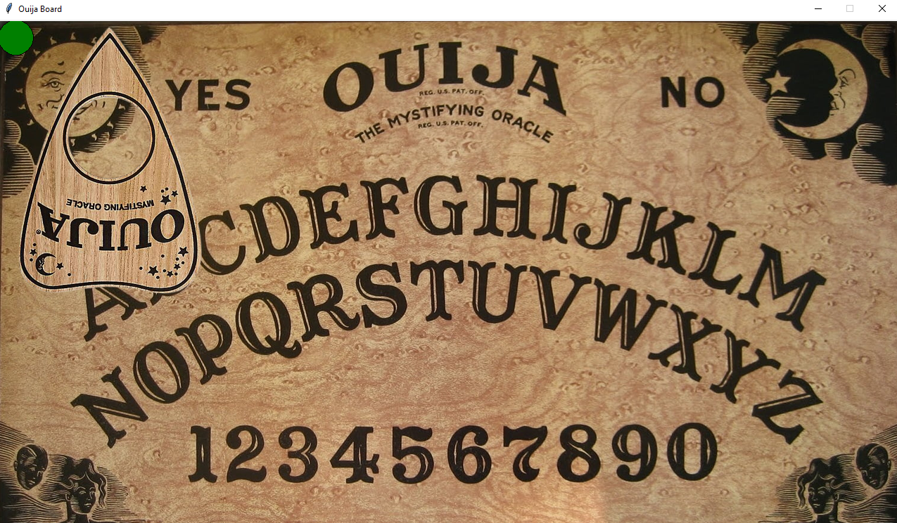
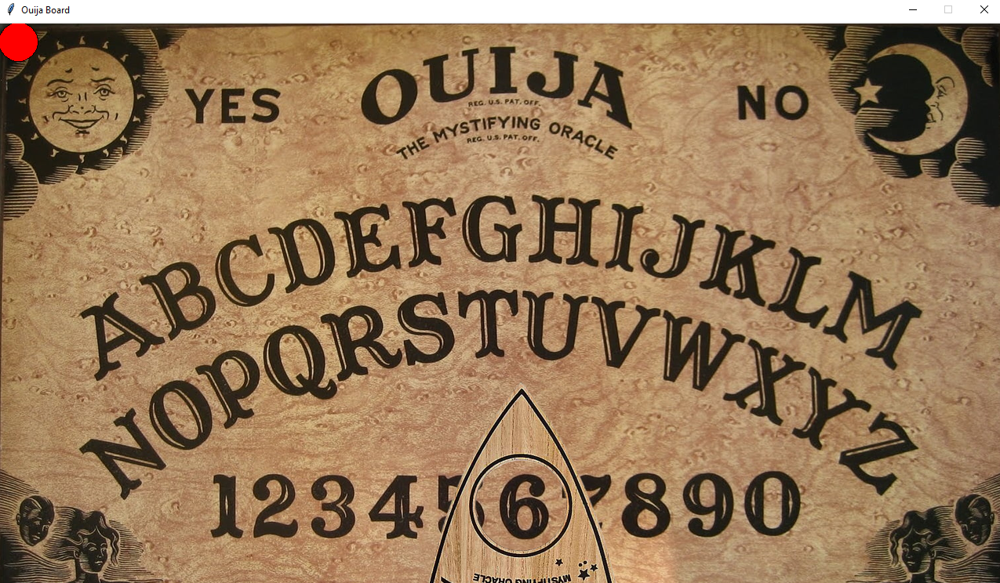

# Ouija Board
Hier habe ich ein Ouija Board Interface mit Tkinter für OpenAIs GPT-3 erstellt. Das war auch das erste mal, dass ich 
eine GUI mit Python erstellt habe. Die Fragen stellt der User über sein Mikrofon. Oben links in der Ecke hat das Ouija Board auch einen Indikator für wann der User sprechen kann (grün).

Hat der User seine Frage gestellt wird diese Frage und der erste Teil der Prompt (damit GPT-3 weiß, was er sein soll/ Kontext hat) an OpenAIs API gestellt, wo GPT-3
die Antwort ergänzt. Diese Antwort (sowie die Frage) wird dann auf der Konsole ausgegeben und auch auf dem Ouija Board [mit dem "Zeiger"] angezeigt.

[Hier](https://edtimes.in/wp-content/uploads/2019/12/06B9F065-6858-48B2-A8EC-5E7A32634BCA.jpeg) ist das Bild für das Ouija Board, welches ich verwendet habe
[Hier](https://spencers.scene7.com/is/image/Spencers/01515006-a?$Detail$) ist das Bild für den "Zeiger", den ich verwendet habe
